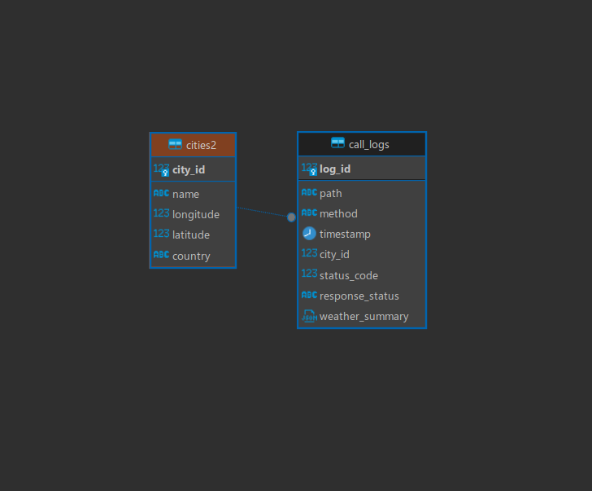

## Overview

To focus on scalability, clarity, and maintainability
the project is organized in following way:

      /my_project
      |-- /app             
          |-- /alembic     # Migrations 
          |-- /api         # API routes
          |-- /logs        # Logging API calls
          |-- /models      # Database models
          |-- /queries     # Database queries
          |-- /schemas     # Models validation schemas
          |-- /settings    # Configurations
          |-- /tests       # API tests
          main.py          # App entrypoint

## Connection to DB
The session is kept open only while the request is being processed, reducing unnecessary open sessions due to using a generator in the get_db function with the yield statement for "lazy" resource usage. 

## DB schema

*city_id is PK for cities2 and FK for call_logs*

## Docker

The app could be run in docker:
      
      docker compose up --build -d

## Potential improvements
1. To adjust cities collection feature. Basically improve db model to reduce duplicates. Now it allows append duplicates.
2. To create API requests caching on Redis, Kafka or other broker